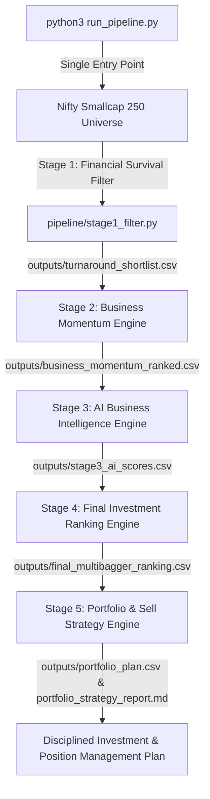

# NSE Multibagger Stock Discovery & Portfolio System

An end-to-end, 5-stage quantitative, qualitative, and risk-managed equity research engine for discovering and managing high-potential multibagger stocks in the Indian market (**Nifty Smallcap 250** universe).

> **Project Root:** `/Users/admin/Developer/smallcap-alpha-engine/`

---

## 📌 Executive Overview & Pipeline Architecture

The pipeline processes raw market universe data through five sequential, modular Python engines coordinated by a single master orchestrator script ([`run_pipeline.py`](file:///Users/admin/Developer/smallcap-alpha-engine/run_pipeline.py)) and standalone cleaner script ([`clean_pipeline.py`](file:///Users/admin/Developer/smallcap-alpha-engine/clean_pipeline.py)):



---

## 🚀 Execution & Maintenance Commands

Detailed operational guidelines are available in [`EXECUTION_GUIDE.md`](file:///Users/admin/Developer/smallcap-alpha-engine/docs/EXECUTION_GUIDE.md).

### 1. Run Pipeline Sequentially (Single Command)
```bash
python3 run_pipeline.py
```

### 2. Clean & Run Pipeline Fresh (Single Command)
```bash
python3 run_pipeline.py --clean
```

### 3. Customizing Portfolio Capital Investment
Default capital is configured in [`run_pipeline.py`](file:///Users/admin/Developer/smallcap-alpha-engine/run_pipeline.py) (line 40: `PORTFOLIO_CAPITAL_INR = 100000.0` for **₹1 Lakh**). You can edit this line in `run_pipeline.py` or pass `--capital`:
```bash
# Override default capital from CLI (e.g. ₹25 Lakhs):
python3 run_pipeline.py --capital 2500000

# Override default capital from CLI (e.g. ₹50 Lakhs):
python3 run_pipeline.py --capital 5000000
```

### 4. Standalone Cleanup Command
To wipe generated CSVs, reports, log files, and `index.html` without running the pipeline:
```bash
# Clean CSVs, reports, logs, and index.html:
python3 clean_pipeline.py

# Clean CSVs, reports, logs, index.html AND research/ folder:
python3 clean_pipeline.py --all
```

---

## 🔍 Complete 5-Stage System Workflow

### Stage 1: Financial Survival Filter
**Script:** [`pipeline/stage1_filter.py`](file:///Users/admin/Developer/smallcap-alpha-engine/pipeline/stage1_filter.py)  
**Question:** *"Can this company survive?"*
- **Universe:** Live Nifty Smallcap 250 constituents.
- **Criteria:** Market Cap ₹2,000 Cr–₹15,000 Cr, 3M Volume > 300,000 shares, Debt/Equity < 0.50, and sequential Net Income expansion ($Q_1 > Q_2 > Q_3$).
- **Output:** [`outputs/turnaround_shortlist.csv`](file:///Users/admin/Developer/smallcap-alpha-engine/outputs/turnaround_shortlist.csv)

### Stage 2: Business Momentum Engine
**Script:** [`pipeline/stage2_momentum.py`](file:///Users/admin/Developer/smallcap-alpha-engine/pipeline/stage2_momentum.py)  
**Question:** *"Is the business fundamentals improving?"*
- **Scoring Framework:** Evaluates sequential quarterly revenue, net income, EBITDA, operating margins, EPS, cash flow, debt trend, and ROCE/ROE.
- **Dynamic Normalization:** Proportional weight redistribution for unavailable quarterly metrics (0–100 scale).
- **Output:** [`outputs/business_momentum_ranked.csv`](file:///Users/admin/Developer/smallcap-alpha-engine/outputs/business_momentum_ranked.csv)

### Stage 3: AI Business Intelligence Engine
**Script:** [`pipeline/stage3_ai_intelligence.py`](file:///Users/admin/Developer/smallcap-alpha-engine/pipeline/stage3_ai_intelligence.py)  
**Question:** *"Why should this improvement continue?"*
- **Institutional AI Framework:** Answers 37 deep business research questions across Business Quality, Growth Visibility, Management, Moat, Solvency Risk, and Long-Term Potential.
- **Document Knowledge Base:** Extracts, cleans, and deduplicates filings from BSE API, exchange portals, and corporate disclosures.
- **Outputs:** [`outputs/stage3_ai_scores.csv`](file:///Users/admin/Developer/smallcap-alpha-engine/outputs/stage3_ai_scores.csv) + Per-ticker Research Reports (`outputs/research/<TICKER>/ai_report.md` & `.pdf`).

### Stage 4: Final Investment Ranking Engine
**Script:** [`pipeline/stage4_ranking.py`](file:///Users/admin/Developer/smallcap-alpha-engine/pipeline/stage4_ranking.py)  
**Question:** *"Which companies deserve capital allocation?"*
- **Integrated 100-Point Scoring Model:**
  $$\text{Final Score} = (\text{Financial Score} \times 0.25) + (\text{Momentum Score} \times 0.35) + (\text{AI Business Score} \times 0.40)$$
- **Classification:** Categorizes stocks into *Emerging Compounder*, *Turnaround Opportunity*, *Cyclical Recovery*, or *Special Situation*.
- **Outputs:**
  - [`outputs/final_multibagger_ranking.csv`](file:///Users/admin/Developer/smallcap-alpha-engine/outputs/final_multibagger_ranking.csv)
  - [`outputs/top_candidates.csv`](file:///Users/admin/Developer/smallcap-alpha-engine/outputs/top_candidates.csv)
  - [`outputs/portfolio_watchlist.csv`](file:///Users/admin/Developer/smallcap-alpha-engine/outputs/portfolio_watchlist.csv)
  - [`outputs/final_investment_report.md`](file:///Users/admin/Developer/smallcap-alpha-engine/outputs/final_investment_report.md)

### Stage 5: Portfolio & Sell Strategy Engine
**Script:** [`pipeline/stage5_portfolio.py`](file:///Users/admin/Developer/smallcap-alpha-engine/pipeline/stage5_portfolio.py)  
**Question:** *"How to execute, allocate capital, and manage exit discipline?"*
- **Capital Allocation & Position Sizing:** Proportional weight calculation with caps/floors, calculating position sizes for a custom or reference portfolio capital.
- **Slab-Wise Profit Booking Framework:**
  - **Slab 1 (+25% Gain):** Sell 20% of position (Lock in early profits & de-risk).
  - **Slab 2 (+50% Gain):** Sell 20% of position (De-risk principal capital).
  - **Slab 3 (+75% Gain):** Sell 20% of position (Secure major gains).
  - **Slab 4 (+100% Gain):** Sell 20% of position (Multibagger milestone achieved).
  - **Free Runner:** Hold remaining 20% with 15% trailing stop loss for uncapped upside.
- **Risk Protection & Exit Triggers:**
  - Initial Hard Stop Loss: **-12.0%** from purchase cost.
  - Trailing Stop Loss: **15.0%** below peak once gain exceeds +50%.
  - Fundamental Thesis Break Triggers: D/E > 0.50, 2 consecutive negative profit quarters, promoter selling > 3%, auditor resignation.
- **Outputs:**
  - [`outputs/portfolio_plan.csv`](file:///Users/admin/Developer/smallcap-alpha-engine/outputs/portfolio_plan.csv)
  - [`outputs/portfolio_strategy_report.md`](file:///Users/admin/Developer/smallcap-alpha-engine/outputs/portfolio_strategy_report.md)

---

## 📊 Master Deliverables Matrix

| Stage | Script / Tool | Primary Output Deliverable |
| :---: | :--- | :--- |
| **Guide** | [`docs/EXECUTION_GUIDE.md`](file:///Users/admin/Developer/smallcap-alpha-engine/docs/EXECUTION_GUIDE.md) | Operational Command Reference Guide |
| **Cleaner** | [`clean_pipeline.py`](file:///Users/admin/Developer/smallcap-alpha-engine/clean_pipeline.py) | Standalone cleanup for all generated outputs |
| **Orchestrator** | [`run_pipeline.py`](file:///Users/admin/Developer/smallcap-alpha-engine/run_pipeline.py) | Single-Command Execution for Stages 1–5 |
| **Stage 1** | [`pipeline/stage1_filter.py`](file:///Users/admin/Developer/smallcap-alpha-engine/pipeline/stage1_filter.py) | [`outputs/turnaround_shortlist.csv`](file:///Users/admin/Developer/smallcap-alpha-engine/outputs/turnaround_shortlist.csv) |
| **Stage 2** | [`pipeline/stage2_momentum.py`](file:///Users/admin/Developer/smallcap-alpha-engine/pipeline/stage2_momentum.py) | [`outputs/business_momentum_ranked.csv`](file:///Users/admin/Developer/smallcap-alpha-engine/outputs/business_momentum_ranked.csv) |
| **Stage 3** | [`pipeline/stage3_ai_intelligence.py`](file:///Users/admin/Developer/smallcap-alpha-engine/pipeline/stage3_ai_intelligence.py) | [`outputs/stage3_ai_scores.csv`](file:///Users/admin/Developer/smallcap-alpha-engine/outputs/stage3_ai_scores.csv) + Research Reports (`outputs/research/<TICKER>/`) |
| **Stage 4** | [`pipeline/stage4_ranking.py`](file:///Users/admin/Developer/smallcap-alpha-engine/pipeline/stage4_ranking.py) | [`outputs/final_multibagger_ranking.csv`](file:///Users/admin/Developer/smallcap-alpha-engine/outputs/final_multibagger_ranking.csv) + [`outputs/final_investment_report.md`](file:///Users/admin/Developer/smallcap-alpha-engine/outputs/final_investment_report.md) |
| **Stage 5** | [`pipeline/stage5_portfolio.py`](file:///Users/admin/Developer/smallcap-alpha-engine/pipeline/stage5_portfolio.py) | [`outputs/portfolio_plan.csv`](file:///Users/admin/Developer/smallcap-alpha-engine/outputs/portfolio_plan.csv) + [`outputs/portfolio_strategy_report.md`](file:///Users/admin/Developer/smallcap-alpha-engine/outputs/portfolio_strategy_report.md) |
